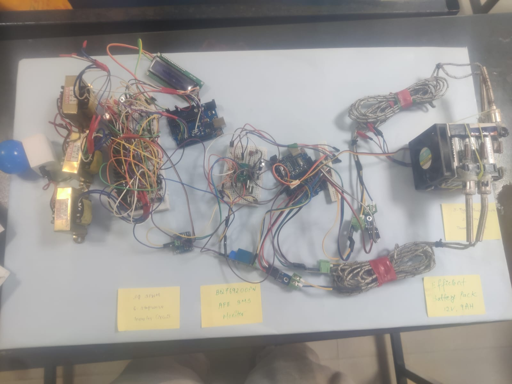
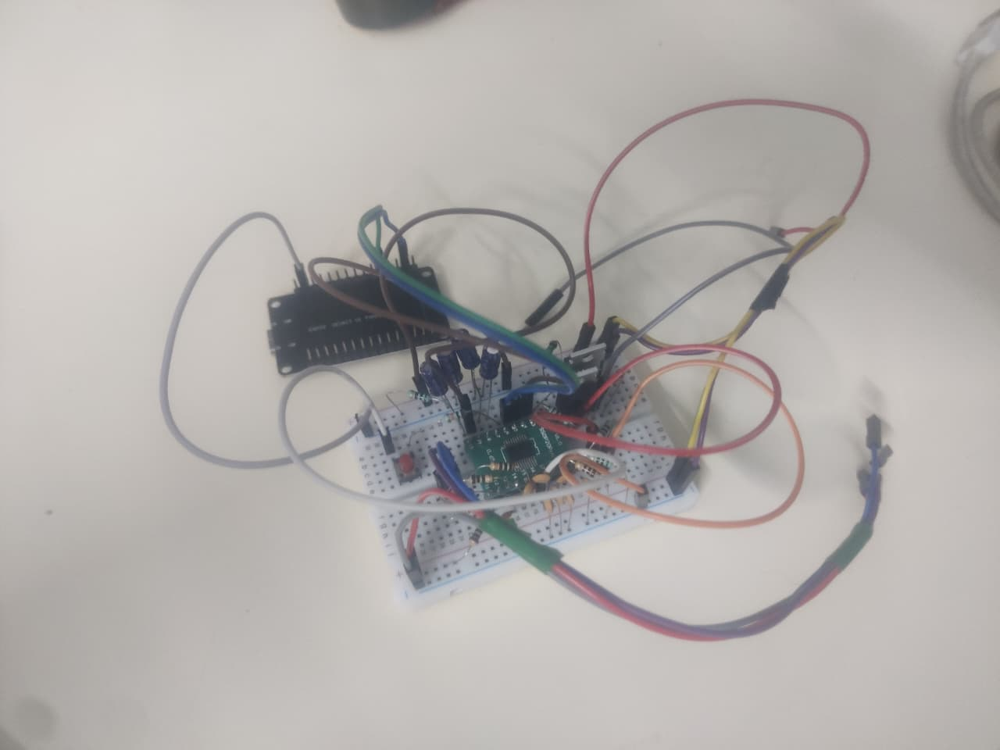
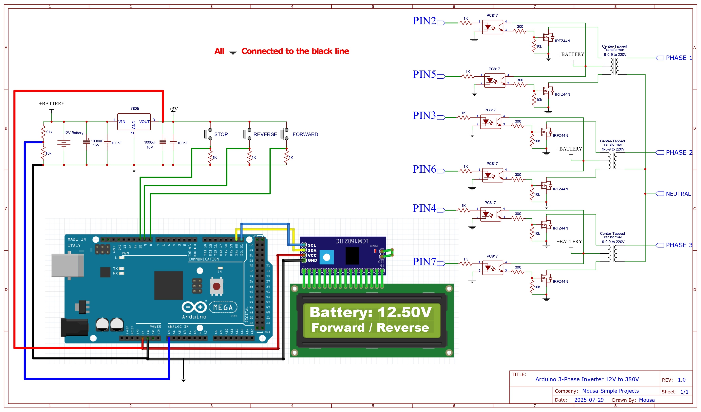
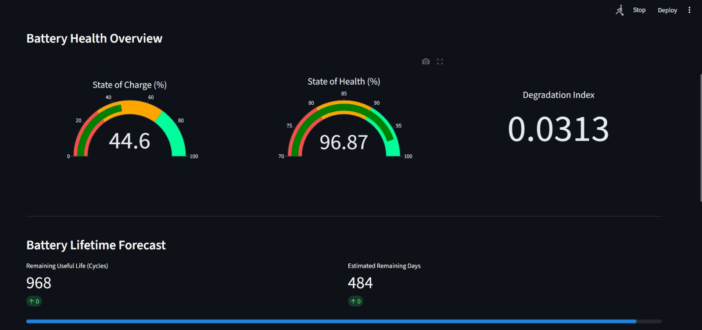
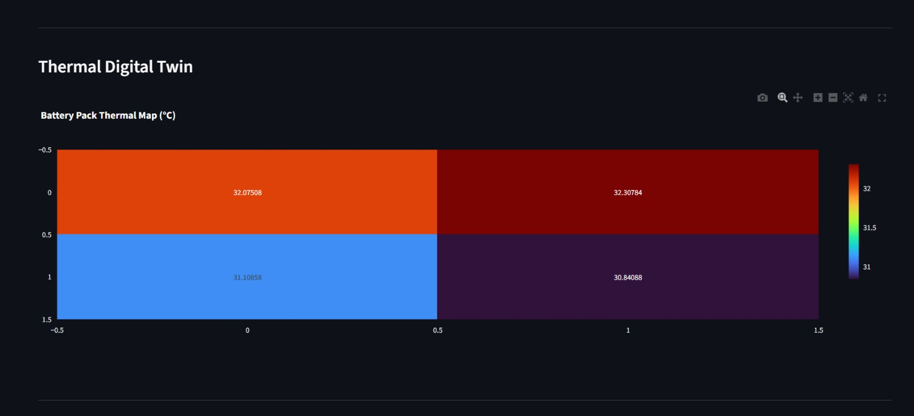
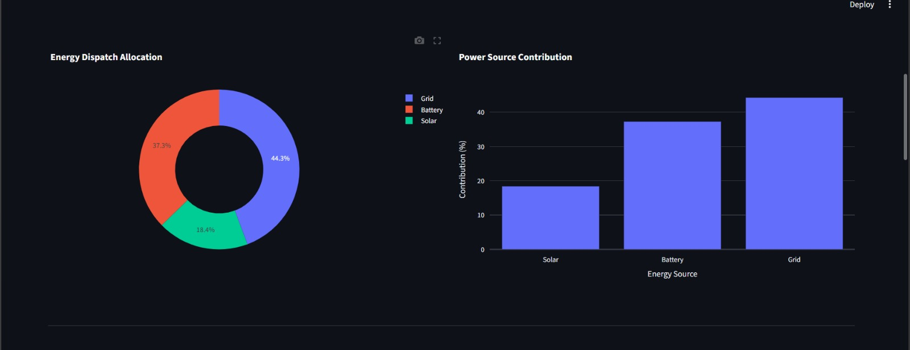

# AI-Powered Energy-Efficient Storage System for Intermittent Renewable Energy Sources

## Overview

This project presents an intelligent energy storage and management system designed to improve the reliability, efficiency, and safety of renewable energy integration. It combines embedded systems, power electronics, IoT, and machine learning to address challenges such as intermittency, battery degradation, and inefficient energy utilization.

The system implements a smart Battery Management System (BMS), AI-driven analytics, thermal fault detection, and intelligent energy dispatch to enable optimized operation in grid-connected and standalone environments.


## Key Features

### Intelligent Battery Management System

* Real-time monitoring of voltage, current, and temperature
* Overcharge, over-discharge, short-circuit, and overcurrent protection
* Cell balancing for improved battery lifespan

### AI-Based Battery Analytics

* Hybrid SOC (State of Charge) estimation
* SOH (State of Health) prediction
* Remaining Useful Life (RUL) estimation
* LSTM/GRU-based machine learning models
* Prediction accuracy exceeding 92%

### Thermal Monitoring and Safety

* Cell-level temperature sensing using embedded thermocouples
* Hotspot detection using statistical and AI-based methods
* PWM-based active cooling system
* Early fault detection to prevent thermal runaway

### Power Conversion System

* 6-pulse three-phase MOSFET inverter
* DC (12V) to AC (415V) conversion
* LC filtering (THD < 5%)
* Grid-connected and islanded operation

### Intelligent Energy Dispatch

* Reinforcement learning-based optimization
* Dynamic power flow management (Solar / Battery / Grid)
* ~92% system efficiency
* ~40% reduction in grid downtime

### IoT and Cloud Integration

* ESP32-based communication
* MQTT protocol for real-time monitoring
* Cloud-based analytics and predictive maintenance



## System Architecture

* Lithium-ion Battery Pack (3p3s)
* Embedded BMS (ESP32)
* Thermal Monitoring Network
* AI Analytics Engine (Python)
* Three-Phase Inverter
* IoT Communication Layer
* Intelligent Energy Dispatch Module





## Technology Stack

### Hardware

* ESP32 Microcontroller
* 18650 Lithium-ion Cells
* MOSFET-based Inverter
* Thermocouples with Amplifiers
* Current & Voltage Sensors
* PWM Cooling System
* LC Filter

[Battery Pack](https://drive.google.com/file/d/1aGwuFVg3GFvnwfREl3egC-jjFpmQauf6/view?usp=sharing)

[Complete Project Setup](https://drive.google.com/file/d/18ig65D0f1dxLcqyanRcrfkC0pvgQGedS/view?usp=sharing)

### Software

* Python
* TensorFlow / Keras
* MATLAB / Simulink
* Arduino IDE
* MQTT Protocol
* Streamlit (Dashboard UI)







## Project Structure

```id="proj-struct-01"
AI-Energy-Storage-System/
│
├── 3PH Waveform/
│   └── (Waveform simulation files)
│
├── Arduino_ESP32 Code Files/
│   ├── BMS_bq76920/
│   ├── BMS_Com/
│   ├── CurrentSensor/
│   ├── Inverter_Code/
│   ├── Inverter_Code_Simple/
│   └── TempControl/
│
├── Assets/
│   └── (SLDs, block diagrams, BOM, etc.)
│
├── Docs/
│   └── (Project report, journal paper, PPTs, etc.)
│
├── Images_Videos/
│
├── Matlab/
│   └── (Battery Modelling, CCCV Charging, Cell Balancing,
│       SOC Estimation, SOH Estimation, BMS Simulation)
│
├── Streamlit UI Code/
│   └── (Updated Streamlit dashboard code)
│
├── Streamlit_V1 - Dashboard/
│   └── (Legacy dashboard code)
│
├── requirements.txt
└── README.md
```


## How to Run the Project

### 1. Hardware Setup

* Assemble lithium-ion battery pack (3p3s)
* Connect BMS with sensors and ESP32
* Integrate inverter and cooling system
* Ensure proper electrical isolation and safety


### 2. Upload Firmware (ESP32)

1. Open Arduino IDE
2. Navigate to:

   ```
   Arduino_ESP32 Code Files/Inverter_Code/
   ```

   or relevant module
3. Configure WiFi & MQTT credentials
4. Upload code to ESP32


### 3. Install Python Dependencies

```id="run-req"
pip install -r requirements.txt
```


### 4. Run IoT Communication

```id="run-mqtt"
python mqtt_client.py
```


### 5. Run Streamlit Dashboard (Latest UI)

```id="run-streamlit"
cd "Streamlit UI Code"
streamlit run app.py
```

Open in browser:

```
http://localhost:8501
```


### 7. MATLAB Simulations (Optional)

* Open MATLAB
* Navigate to `/Matlab` folder
* Run required simulations:

  * Battery modelling
  * CCCV charging
  * SOC/SOH estimation
  * Cell balancing

## Testing

[1PH Testing](https://drive.google.com/file/d/1jwWScOXZGDvcIQ5-eBMCt8Miwgf5Twie/view?usp=sharing)

[3PH Testing](https://drive.google.com/file/d/1JlvMbLjfURrDsCK58k0Iy_6T9Hr3GaSQ/view?usp=sharing)

[Battery Inverter Testing](https://drive.google.com/file/d/10VA0pKXwyq8vbFC8IdaSfsOvfnUyro8E/view?usp=sharing)

[Thermal Testing](https://drive.google.com/file/d/1LTgNXBUUaM-lFqWra9CsQLi4A3scTGJT/view?usp=sharing)


## Performance Highlights

* SOC estimation error: < 3%
* SOH prediction accuracy: > 92%
* Inverter efficiency: ~88–90%
* THD: < 5%
* Energy efficiency: ~92%
* Grid downtime reduction: ~40%


## Applications

* Renewable energy storage
* Microgrids and smart grids
* Solar PV systems
* Battery analytics platforms
* Predictive maintenance


## Future Scope

* Grid-scale deployment
* Digital twin integration
* Edge AI optimization
* EV charging integration
* Advanced monitoring systems


## Contributors

* T S Yeswanth
* Prajen S K

Department of Electrical and Electronics Engineering
Chennai Institute of Technology


## License

This project is intended for academic and research purposes. Licensing can be extended for commercial applications in future development.
